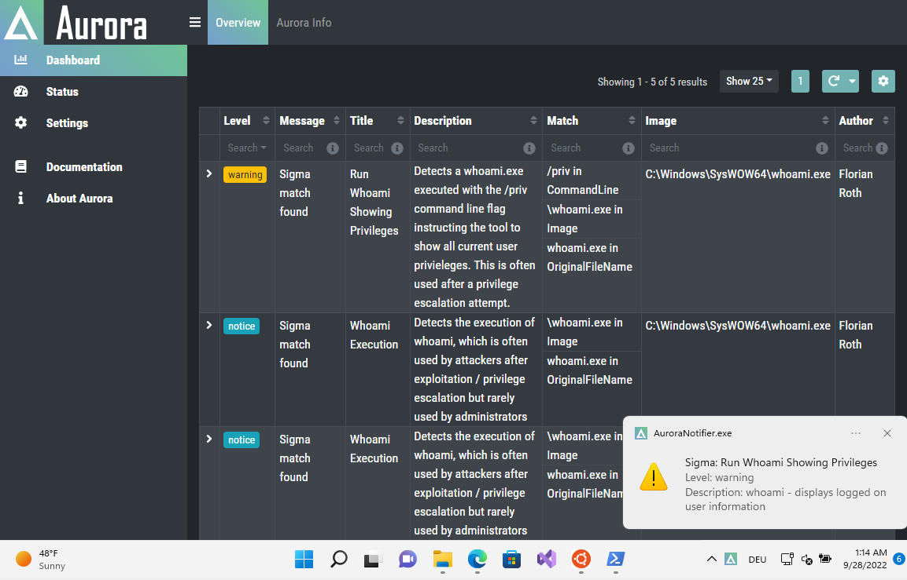
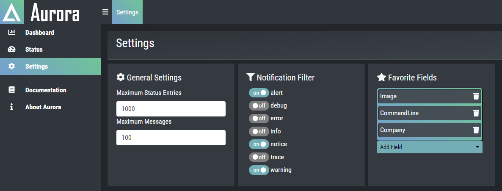

Aurora Agent Dashboard
=======================

Aurora Agent Dashboard provides a way to review Aurora events and get notifications for them:

Dashboard Activation
--------------------

Aurora can be started or installed with the dashboard feature using the ``--dashboard`` flag:

Examples:

.. code:: doscon

   C:\aurora>aurora-agent-64.exe --install --dashboard
   C:\aurora>aurora-agent-64.exe --dashboard

Dashboard UI Access
-------------------

The Dashboard can be accessed with your favorite browser using the following URL:
:samp:`http://localhost:17494/ui/dashboard/overview`

There are also some shortcuts to open the dashboard such as:
  - Click on a notification message
  - Right click the tray icon and then select ``Open Dashboard``

Notifications
-------------

The filter for which events will produce notifications can be configured either in
the tray icon in the ``Options`` sub menu or in the dashboard's ``Settings``-section.

Settings
--------

The settings can be accessed in the ``Settings`` Section in the dashboard.

General Settings 
~~~~~~~~~~~~~~~~

* Maximum Status Entries   
  
  - Sets the Maximum Status Entries that will be saved in Memory

* Maximum Messages

  - Sets the Maximum Count of Aurora Event Messages that will be saved in Memory

Favorite Fields
~~~~~~~~~~~~~~~

You can set favorite fields in the ``Settings`` section. These fields are
shown in the configured order in every event you expand. You can change
the order by dragging and dropping the fields in the ``Favorite Fields`` list. 
