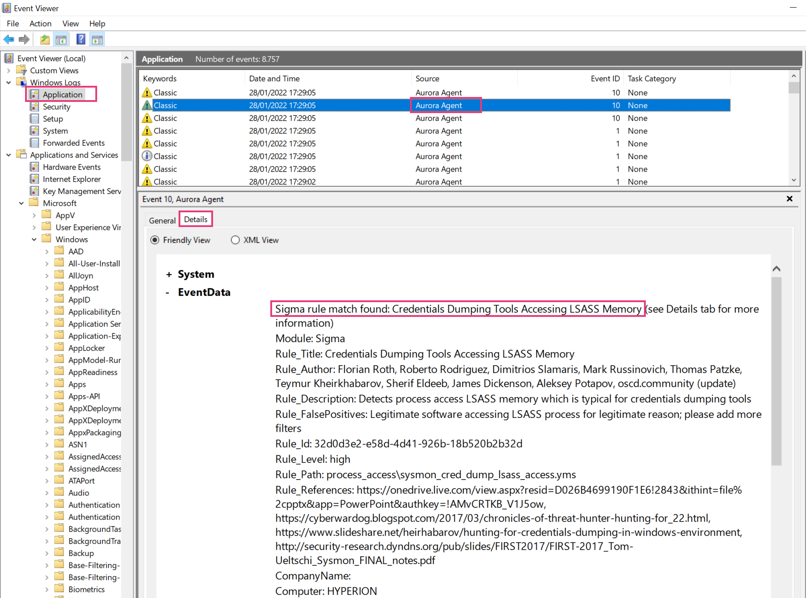

Configuration
=============

Aurora uses the YAML format for its configuration file. All values set in the config file can also be used as command line flags. 

There are two modes of operation:

1. Aurora started directly from the command line, optionally using a config passed with the ``--config`` / ``-c`` flag
2. Aurora started as a service (see chapter :doc:`installation </usage/installation>` for more details) with a config file located in ``C:\Program Files\Aurora-Agent\agent-config.yml``

Configuration Presets
---------------------

To facilitate the use of Aurora, four configuration files are part of the Aurora package:

- Standard (``agent-config-standard.yml``)
- Reduced (``agent-config-reduced.yml``)
- Minimal (``agent-config-minimal.yml``)
- Intense (``agent-config-intense.yml``)

An installation that uses the preset named "reduced" would look like this: 

.. code:: winbatch

    aurora-agent.exe --install -c agent-config-reduced.yml

The configuration presets effect the following settings:

+-------------------------------+-----------------------+--------------------------+------------------------+-------------------+
| Affected Setting              | Minimal               | Reduced                  | Standard               | Intense           |
+===============================+=======================+==========================+========================+===================+
| Deactivated sources           | | Registry            | | Registry               | | Registry             |                   |
|                               | | Raw Disk Access     | | Raw Disk Access        | | Raw Disk Access      |                   |
|                               | | Kernel Handles      | | Kernel Handles         | | Kernel Handles       |                   |
|                               | | Create Remote Thread| | Create Remote Thread   | | Create Remote Thread |                   |
|                               | | Process Access      | | Process Access         |                        |                   |
|                               | | Image Loads         |                          |                        |                   |
+-------------------------------+-----------------------+--------------------------+------------------------+-------------------+
| CPU Limit                     | 20%                   | 30%                      | 35%                    | 100%              |
+-------------------------------+-----------------------+--------------------------+------------------------+-------------------+
| Process Priority              | Low                   | Normal                   | Normal                 | Normal            |
+-------------------------------+-----------------------+--------------------------+------------------------+-------------------+
| Minimum Reporting Level       | High                  | High                     | Medium                 | Low               |
+-------------------------------+-----------------------+--------------------------+------------------------+-------------------+
| Deactivated modules           | | LSASS Dump Detector | | LSASS Dump Detector    |                        |                   |
|                               | | BeaconHunter        |                          |                        |                   |
+-------------------------------+-----------------------+--------------------------+------------------------+-------------------+

.. warning::
    Intense preset uses the most system resources and can put the system under heavy load,
    especially if a process accesses many registry keys in a short amount of time.

    We recommend using this preset only on a very selective set of systems or in cases in which maximum detection is required.

Custom Profiles
~~~~~~~~~~~~~~~

If you need a more specialized configuration than these predefined ones, you can also create your own configuration for maximal adaptability.

Output Options
--------------

The following output options are available 

- Windows Eventlog (default)
- Log file
- UDP target
- TCP target

ASGARD Analysis Cockpit
~~~~~~~~~~~~~~~~~~~~~~~

Whenever you install an ASGARD Agent, the controlled Aurora Agent Services gets its configuration automatically. In a default setup, all logs generated by an Aurora Agent will be relayed via an ASGARD to an Analysis Cockpit system.

Windows Eventlog
~~~~~~~~~~~~~~~~

By default Aurora writes its event into the Windows event log "Application". To review the events use the Windows "EventViewer". Make sure to check the "Details" tab to see all fields and values.

UDP / TCP targets
~~~~~~~~~~~~~~~~~

UDP or TCP log targets can be specified via the ``--udp-target`` and ``--tcp-target`` options. These options take an argument in the form ``host:port``, e.g. ``myloggingsystem.internal:8443``.

Log file
~~~~~~~~

A log file can be specified using ``--logfile``. By default, no log file is written.

The log file is automatically rotated by Aurora once more than ``--log-size`` bytes have been written to it (default is 10MB).
``--log-rotate`` can be used to specify the number of log rotations that are retained (defaults to 7).

Log rotation can be disabled by setting ``--log-size`` to 0.

False positive filtering
------------------------

When encountering false positives or known anomalies, besides reporting them, you can also exclude them using a false positive filter file.
By default, ``config/false-positives.cfg`` is used.

The file passed should contain a regular expression per line; any log lines where any of these false positive regexps matches
will not be logged.

If you want to exclude all events from a specific process, process exclusions might be a better choice than a false positive filter
since they also cancel any analysis on those events; see
:ref:`Process Exclusions <Process Exclusions>` for more details.
