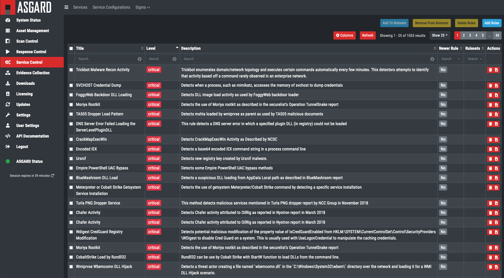

Custom Signatures and IOCs
==========================

Management using ASGARD
-----------------------

ASGARD Management Center allows you to create rule sets of sigma rules and apply 
hem to groups of end systems. It also features a "difference view" that shows you
rules that have changed in the remote Sigma repository and allows you to accept
or deny the changes. It also provides ways to filter false positives right at the source.

Signature updates and Aurora upgrades can be executed for all end points from the Management Center.

The rule management is described in more detail in
`this <https://asgard-manual.nextron-systems.com/en/latest/administration/sigma.html>`_
section of the ASGARD Management Center manual.

Manual signature management
---------------------------

Signatures can be specified when starting Aurora using the ``--rules-path`` and
``--ioc-path`` parameters. These parameters default to the built-in rules and IOCs at 
``signatures\sigma-rules`` and ``signatures\iocs`` and the provided paths for
custom signatures at ``custom-signatures\sigma-rules`` and ``custom-signatures\iocs`` respectively. 
Aurora traverses the directories that are specified with these parameters recursively
and initializes all signature files it finds.

In order to add new sigma rules or IOCs, you can either:

 - Add them to the corresponding subfolder in `custom-signatures`
 - Specify the folder where they are located using ``--rules-path`` or ``--ioc-path``

.. warning::
   If you specify ``--rules-path`` or ``--ioc-path``, if you want to use the Aurora built-in rules and IOCs,
   you need to add them manually as well. E.g.:
   
   .. code-block:: doscon

        C:\Program Files\Aurora-Agent>aurora-agent.exe --install --rules-path .\signatures\sigma-rules --rules-path .\my-rules

   If paths are configured, only the configured paths are used.

Signature format
^^^^^^^^^^^^^^^^

IOCs follow the same format that THOR IOCs do; the full description can
be found in the `THOR manual <https://thor-manual.nextron-systems.com/en/latest/usage/custom-signatures.html#simple-iocs>`_.

Sigma rules must adhere to the specification found in the `Sigma repository <https://github.com/SigmaHQ/sigma/wiki/Specification>`_.

Encrypted signatures
^^^^^^^^^^^^^^^^^^^^

Both IOCs and sigma rules can be encrypted using the ``encrypt`` function
in Aurora Agent Util. Aurora will automatically decrypt encrypted signatures at startup. 
This functionality is only available in the full version of Aurora.

Signature Application
---------------------

Sigma rules
^^^^^^^^^^^
Sigma rules must contain a ``logsource`` element which (indirectly) determines on which events the sigma rule is applied.

Aurora utilizes a number of `log sources` which map between these ``logsource`` elements and the actual sources.
The log source definitions which can be found in the ``log-sources`` folder. Rules
are applied on every log source which has a matching ``logsource`` definition.

Log sources may also utilize:
 - ``conditions`` to filter events from the given sources
 - ``fieldmappings`` to rename specific fields in the events that occur. This is
   useful to have all events with the same ``logsource`` appear to have the same
   fields, even if the underlying sources and field names differ.
 - ``rewrite`` to reference each other. ``rewrite`` is meant to be used in combination
   with the other elements: For example, Sysmon events are split into different
   categories using ``conditions`` and ``rewrite``.

IOCs
^^^^

Hashes
~~~~~~

Hash IOCs are applied to:

 - Process creation events
 - Image load events
 - Driver load events

Filenames
~~~~~~~~~

Filename IOCs are applied to:

 - Process creation events
 - Image load events
 - File creation events
 - Handle events that reference files
 - Driver load events

C2
~~~

C2 IOCs are applied to:

 - DNS query events
 - TCP connection events

Named Pipe
~~~~~~~~~~

Named Pipe IOCs are applied to handle events that reference named pipes.

Handle
~~~~~~

Handle IOCs (which include mutex and event IOCs) are applied to handle events.