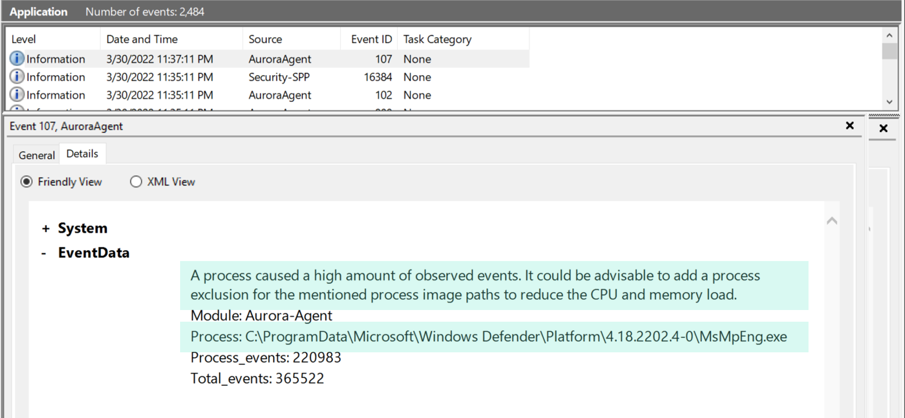
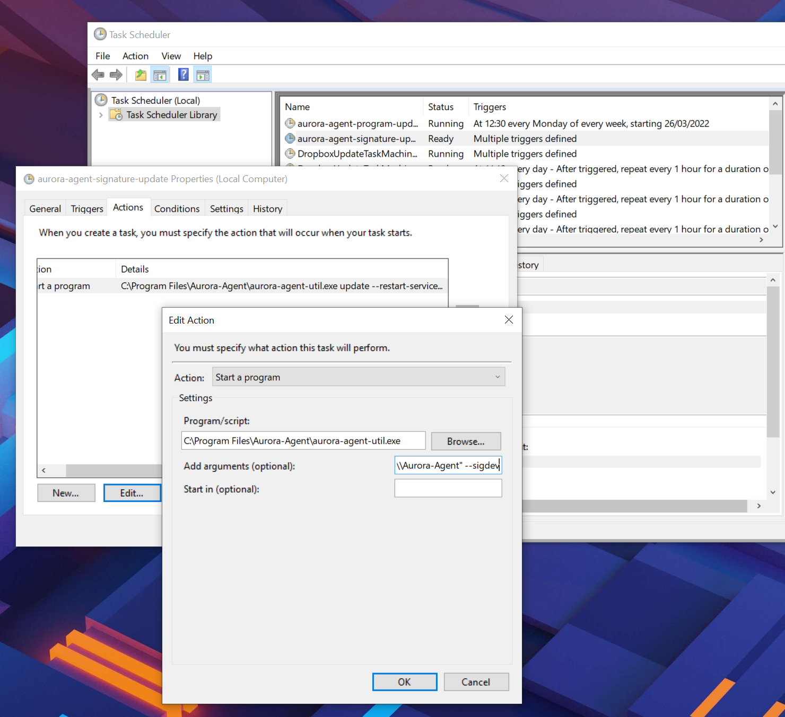

Frequently Asked Questions
==========================

Why does Aurora use a lot of memory? 
------------------------------------

The short answer is: because it can. 

The long answer is related to the way the go runtime manages the memory. There are many articles that describe the way `how the garbage collector works <https://medium.com/safetycultureengineering/an-overview-of-memory-management-in-go-9a72ec7c76a8>`_ but only a few that describe situations in which a program `used a unexpectedly high amount of memory <https://blog.detectify.com/2019/09/05/how-we-tracked-down-a-memory-leak-in-one-of-our-go-microservices/>`_. 

   It turns out that there was a change in Go 1.12 regarding how the runtime signals the operating system that it can take unused memory. Before Go 1.12, the runtime sends a MADV_DONTNEED signal on unused memory and the operating system immediately reclaims the unused memory pages. Starting with Go 1.12, the signal was changed to MADV_FREE, which tells the operating system that it can reclaim some unused memory pages if it needs to, meaning it doesn't always do that unless the system is under memory pressure from different processes.

So, yes, it is possible that the Aurora agent uses much more memory than the usual 200-300 MB, but only in cases in which there is a lot of free available memory. The operating system should be able to claim that excessive memory whenever needed. 

If you notice that this is not the case, please provide a diagnostics pack, which also includes a complete memory profile of a running Aurora agent. 

See the section :ref:`usage/aurora-agent-util:creating a diagnostics pack` of the Aurora Agent Util chapter for details.

What's the impact of Sigma rule matching on the agent's performance? 
--------------------------------------------------------------------

Users are often interested in the matching process and ask questions like: "What's the performance impact with such a design? How scalable it is, let's say with 100 / 1000 / 10,000 sigma rules?" 

The answer is that the impact isn't proportionate and thus much lower than expected. We use a matching logic that is very similar to the one used in i.e. YARA and therefore adding 1,000 rules to existing 1,000 rules would only slow down the agent by around 1-3%.

The most CPU cycles are spent on reading and parsing the events from the different ETW event channels. This means that a process that produces a disproportionately high number events in these channels causes much more impact than adding 1,000 or 10,000 sigma rules. 

Aurora has some detection logic to detect and report such processes in separate log messages with ID 107. In the release version Aurora reports all processes that are responsible for more than 50% of the total number of events. 

Why does Aurora Lite use the newest rules while Aurora doesn't?
---------------------------------------------------------------

The rules used by our commercial product go through an intensive internal testing process before we release them to our customers. The rule set used by Aurora includes the `Github repository <https://github.com/SigmaHQ/sigma/tree/master/rules>`_ maintained by the Sigma community and Nextron's own private Sigma rules.

The tests include: 

- Sigma tests against EVTX files exported from 30+ different test systems
- Live tests on 4+ Windows machines with simulated user activity 
- 24h live endurance tests on 30+ different test systems 

The Aurora Lite version always uses the current ``master`` of the `Github repository <https://github.com/SigmaHQ/sigma/tree/master/rules>`_ maintained by the Sigma community. This set goes through some rudimentary testing against exported EVTX files but isn't tested on live systems. 

If you want to use the most current and untested rule set, you can add the ``--sigdev`` flag to the command line flags used by the update tasks (add it right after the ``update`` or ``upgrade`` command). Please be aware that support cases caused by the use of that untested rule set may not be covered by the existing maintenance or support contract.  

Why does Aurora generate two alerts for a single event? 
-------------------------------------------------------

Aurora registers to different event channels that sometimes contain the same information. It is possible that Aurora notices the same activity in two different channels and generates two alerts for a single event. 

In these cases, the alerts should have different values set in the ``Provider_Name`` field, e.g. ``Provider_Name: Microsoft-Windows-Kernel-Process`` and ``Provider_Name: Microsoft-Windows-Sysmon``. 

It is unclear which of the two alerts should be suppressed in order to avoid these duplicate notifications, as they do not include identical information and in some situations one is preferred over the other or vice versa.

How do I view the suppressed Sigma matches?
-------------------------------------------

In some messages, e.g. in the reported statistics (``--report-stats``) or the status message (``--status``), you may find a number of suppressed Sigma matches

.. code:: none 

    Event Statistics:
    Events observed so far: 23483429
    Events lost so far: 0
    Sigma matches: 13
    Suppressed Sigma matches of those: 6

Use the flag combination ``--status --trace`` to view which Sigma rule matches have been suppressed. 

.. literalinclude:: ../examples/faq-status-trace
   :language: doscon
   :linenos:

The match throttling can be configured with the flags ``--match-burst`` and ``--match-throttling``. We recommend keeping the default. It does not suppress  matches of a rule that you haven't already noticed in the defined time frame (each rule triggers at least ``--match-burst`` number of times before being throttled). It only throttles numerous matches of a single rule; cases in which a single rule causes numerous matches in the defined time frame, which is typically the cause of a noisy / too sensitive rule.

Why does the Event ID in the Windows Eventlog differ from the one in the Event Data?
------------------------------------------------------------------------------------

There's a difference between the Event IDs in the source channels and the Event IDs that we use to write into the various output channels. 

The Event ID that you find in the event data is the one provided in the ETW channel that Aurora subscribes to. The Event ID used to write these events into the local Windows Eventlog differ from these Event IDs and are controlled by Aurora.  

.. figure:: ../images/event-id-difference.png
   :target: ../images/event-id-difference.png
   :alt: Difference in EventIDs

Why does Aurora take so long to start?
--------------------------------------

Almost all of the startup time comes from loading and compiling the IOCs and Sigma rules. ``--debug`` gives more information on what Aurora is doing during startup.

If you don't need all IOCs and Sigma rules, it can be helpful to use ``--deactivate-module``, ``--ioc-path`` and ``--rules-path`` to significantly reduce the startup time:

- ``--deactivate-module ApplyIOCs --rules-path my-custom-rule.yml`` deactivates IOCs completely and only loads the specified sigma rule.
- ``--deactivate-module Sigma --ioc-path my-custom-filename-ioc.txt`` deactivates Sigma rules completely and only loads the specified filename IOC file.

Why doesn't Aurora report Registry matches?
-------------------------------------------

The reason is that ETW provides only insufficient data in the respective event channels. Aurora has to perform some resource intensive check whenever processes access the Windows registry. We have therefore activated these checks only in the "intense" preset.

See chapter :ref:`usage/detection-gaps:detection gaps` for more details.

