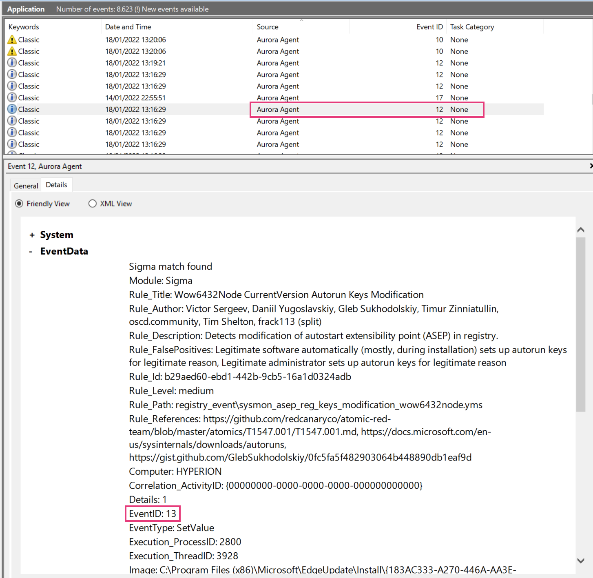

Frequently Asked Questions
==========================

Why does Aurora generate two alerts for a single event? 
-------------------------------------------------------

Aurora registers to different event channels that sometimes contain the same information. It is possible that Aurora notices the same activity in two different channels and generates two alerts for a single event. 

In these cases, the alerts should have different values set in the ``Provider_Name`` field, e.g. ``Provider_Name: Microsoft-Windows-Kernel-Process`` and ``Provider_Name: Microsoft-Windows-Sysmon``. 

It is difficult to decide which of the two alerts should be suppressed in order to avoid these duplicate notifications.

How do I view the suppressed Sigma matches?
-------------------------------------------

In some messages, e.g. in the reported statistics (``--report-stats``) or the status message (``--status``), you may find a number of suppressed Sigma matches

.. code:: none 

    Event Statistics:
    Events observed so far: 23483429
    Events lost so far: 0
    Sigma matches: 13
    Suppressed Sigma matches of those: 6

Use the flag combination ``--status --trace`` to view which Sigma rule matches have been suppressed. 

.. code:: winbatch 

    C:\Program Files\Aurora Agent\>aurora-agent-64.exe --status --trace
    Aurora Agent
    Version: 0.8.3
    Build Revision: 0ebc3322ef722
    Signature Revision: 2022/03/18-071411
    Sigma Revision: 0.20-3305-g41fce11b7
    Status: running
    Uptime (in hours): 3

    Active Outputs:
    Windows Application Eventlog: enabled

    Errors: 0
    Alerts: 0
    Warnings: 3
    Notices: 3

    Active Modules:
    LsassDumpDetector
    BeaconHunter
    EtwCanary
    CommandLineMismatchDetector
    ProcessTamperingDetector
    TemporaryDriverLoadDetector
    ApplyIOCs
    Rescontrol
    Sigma
    ETW-Provider
    ETW-Kernel-Provider
    Eventlog-Provider
    Handle-Polling

    Rule Statistics:
    Rule paths: C:\Program Files\Aurora-Agent\signatures\sigma-rules, C:\Program Files\Aurora-Agent\custom-signatures
    Loaded rules: 1278
    Number of rule reloads: 0

    Event Statistics:
    Events observed so far: 14910173
            By source:
                    11576611 events from PollHandles
                    1243583 events from WinEventLog:Microsoft-Windows-Sysmon/Operational
                    798200 events from WinEventLog:Microsoft-Windows-Kernel-Audit-API-Calls
                    612929 events from WinEventLog:Microsoft-Windows-Kernel-File/KERNEL_FILE_KEYWORD_CREATE
                    596308 events from WinEventLog:Microsoft-Windows-Kernel-File/KERNEL_FILE_KEYWORD_FILEIO?eventids=14
                    49120 events from WinEventLog:Microsoft-Windows-Kernel-Process/WINEVENT_KEYWORD_THREAD
                    23104 events from WinEventLog:Microsoft-Windows-Kernel-Process/WINEVENT_KEYWORD_IMAGE
                    3087 events from WinEventLog:Microsoft-Windows-DNS-Client
                    1604 events from WinEventLog:Microsoft-Windows-TCPIP/ut:ConnectPath
                    1370 events from WinEventLog:{fbb4fbaa-2ae9-5b86-6d76-09930a11a03d}?fromownpid=1
                    1028 events from SystemLogger:Process
                    760 events from WinEventLog:Microsoft-Windows-Kernel-File/KERNEL_FILE_KEYWORD_DELETE_PATH
                    637 events from WinEventLog:Microsoft-Windows-Kernel-File/KERNEL_FILE_KEYWORD_CREATE_NEW_FILE
                    589 events from WinEventLog:Microsoft-Windows-WinINet/WININET_KEYWORD_HANDLES
                    508 events from WinEventLog:Microsoft-Windows-Kernel-Process/WINEVENT_KEYWORD_PROCESS
                    376 events from WinEventLog:Microsoft-Windows-TaskScheduler/Operational
                    165 events from WinEventLog:Security
                    142 events from WinEventLog:Microsoft-Windows-Kernel-File/KERNEL_FILE_KEYWORD_RENAME_SETLINK_PATH
                    27 events from WinEventLog:Microsoft-Windows-WMI-Activity/Operational
                    9 events from WinEventLog:System
                    8 events from WinEventLog:Microsoft-Windows-Windows Defender/Operational
                    8 events from WinEventLog:Application
            By process:
                    4753497 events from C:\Windows\System32\svchost.exe
                    1635086 events from C:\Users\neo\Downloads\ProcessExplorer\procexp64.exe
                    1462611 events from C:\Windows\Sysmon64.exe
                    783397 events from C:\Windows\System32\mmc.exe
                    751224 events from C:\Users\neo\AppData\Local\Programs\Microsoft VS Code\Code.exe
                    708535 events from C:\Windows\System32\RuntimeBroker.exe
                    657888 events from C:\Windows\explorer.exe
                    476060 events from C:\Program Files (x86)\Microsoft\Edge\Application\msedge.exe
                    334371 events from C:\Windows\SystemApps\Microsoft.Windows.Search_cw5n1h2txyewy\SearchApp.exe
                    288844 events from C:\Windows\System32\SearchIndexer.exe
                    190653 events from C:\Windows\SystemApps\ShellExperienceHost_cw5n1h2txyewy\ShellExperienceHost.exe
                    189455 events from C:\Program Files\WindowsApps\Microsoft.YourPhone_1.22012.167.0_x64__8wekyb3d8bbwe\YourPhone.exe
                    179109 events from C:\Windows\System32\dwm.exe
                    166455 events from C:\Windows\ImmersiveControlPanel\SystemSettings.exe
                    161133 events from C:\Program Files\WindowsApps\Microsoft.549981C3F5F10_3.2202.10603.0_x64__8wekyb3d8bbwe\Cortana.exe
                    156229 events from C:\Program Files\WindowsApps\Microsoft.Windows.Photos_2021.21090.10008.0_x64__8wekyb3d8bbwe\Microsoft.Photos.exe
                    ...

    False positive filters: 0
    Process excludes: 0

    Events missed so far: 0
    Sigma matches: 6
            Run Whoami Showing Privileges: 3
            Whoami Execution: 3
    Suppressed Sigma matches of those: 0

    Response Actions: disabled

The match throttling can be configured with the flags ``--match-burst`` and ``--match-throttling``. We recommend keeping it in the default. It does not suppress  matches of a certain rule that you haven't already noticed in the defined time frame. It throttles numerous matches of a single rule; cases in which a single rule causes numerous matches in the defined time frame, which is typically the cause of a noisy / too sensitive rule. 

Why does the Event ID in the Windows Eventlog differ from the one in the Event Data?
------------------------------------------------------------------------------------

There's a difference between the Event IDs in the source channels and the Event IDs that we use to write into the various output channels. 

The Event ID that you find in the event data is the one provided in the ETW channel that Aurora subscribes to. The Event ID used to write these events into the local Windows Eventlog differ from these Event IDs and are controlled by Aurora.  

