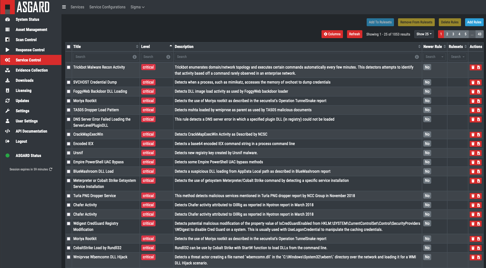

Upgrading and Updating Aurora
=============================

Management using ASGARD
-----------------------

ASGARD Management Center allows you to create rule sets of sigma rules and apply them to groups of end systems. It also features a "difference view" that shows you rules that have changed in the remote Sigma repository and allows you to accept or deny the changes. It also provides ways to filter false positives right at the source.

Signature updates and Aurora upgrades can be executed for all end points from the Management Center.

The rule management is described in more detail in `this <https://asgard-manual.nextron-systems.com/en/latest/usage/administration.html#service-control>`_ section of the ASGARD Management Center manual.

Manual Upgrades and Updates
---------------------------

Aurora Agent Upgrades
---------------------

Aurora can be upgraded using the Aurora Agent Util binary that is distributed as part of the Aurora Agent package.
To upgrade Aurora to the latest version, use:

.. code::

   .\aurora-agent-util.exe upgrade

When upgrading Aurora while it is installed, make sure to:

 - Stop the Aurora Agent service
 - Upgrade the installed version using the Aurora Agent Util under ``C:\Program Files\Aurora-Agent``
 - Restart the Aurora Agent service

Signature Updates
-----------------

When Aurora Agent is installed, it adds a scheduled task that checks daily for signature updates and automatically restarts the service. Usually, this is sufficient and no manual action is necessary.

To manually update Aurora's built-in signatures, use the Aurora Agent Util binary that is distributed as part of the Aurora Agent package:

.. code::

   .\aurora-agent-util.exe update

You can use ``--auto-reload`` to automatically reload built-in or custom signatures after you have manually updated them (see the :doc:`configuration </usage/configuration>` chapter for more details). If you do not use ``--auto-reload``, make sure to restart the Aurora service for the new signatures to take effect.
